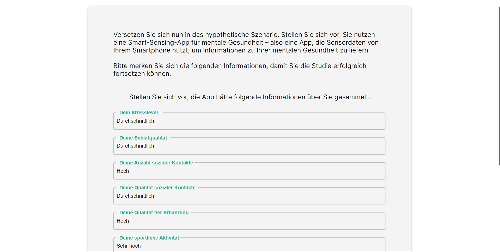
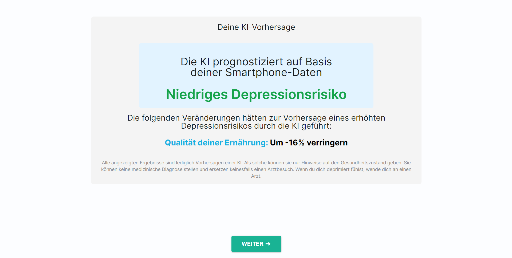
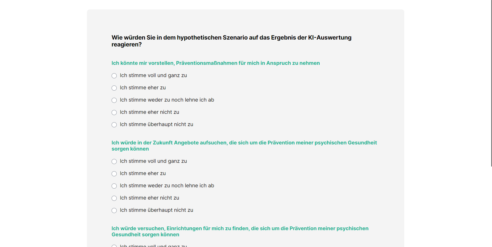

# XAI-Mental-Health
## Motivation

XAI-Mental-Health is a pioneering project developed for the Institute of Business Analytics at Ulm University. This survey website tests various XAI (Explainable Artificial Intelligence) explanation methods in the context of mental health. Its purpose is to explore how different explanations can affect user understanding and trust in AI-driven mental health evaluations.

The website was used in a study that was published as a conference paper in the Proceedings of the 58th Hawaii International Conference on System Sciences (HICSS) 2025.

Link: https://scholarspace.manoa.hawaii.edu/server/api/core/bitstreams/6c7cb44c-a8c5-4da9-8540-f40a19ec44e3/content

## Frameworks and Technologies Used

XAI-Mental-Health utilizes the MERN stack, complemented by Next.js for improved SSR capabilities, and Docker for environment consistency.

### MERN Stack

- **MongoDB:** Handles data storage with flexibility to manage diverse survey data.
- **Express.js:** Simplifies backend API development for efficient data operations.
- **React:** Ensures a dynamic and responsive user interface for survey participants.
- **Node.js:** A server-side runtime environment that allows for backend code execution in JavaScript.
- **Next.js:** Provides server-side rendering to enhance the performance and SEO of the application.

### Docker
Docker containers are used to encapsulate the project's environment, ensuring that it runs uniformly across all machines.

## Screenshots

### Sample Persona

### Sample Explanation

### Survey Page

